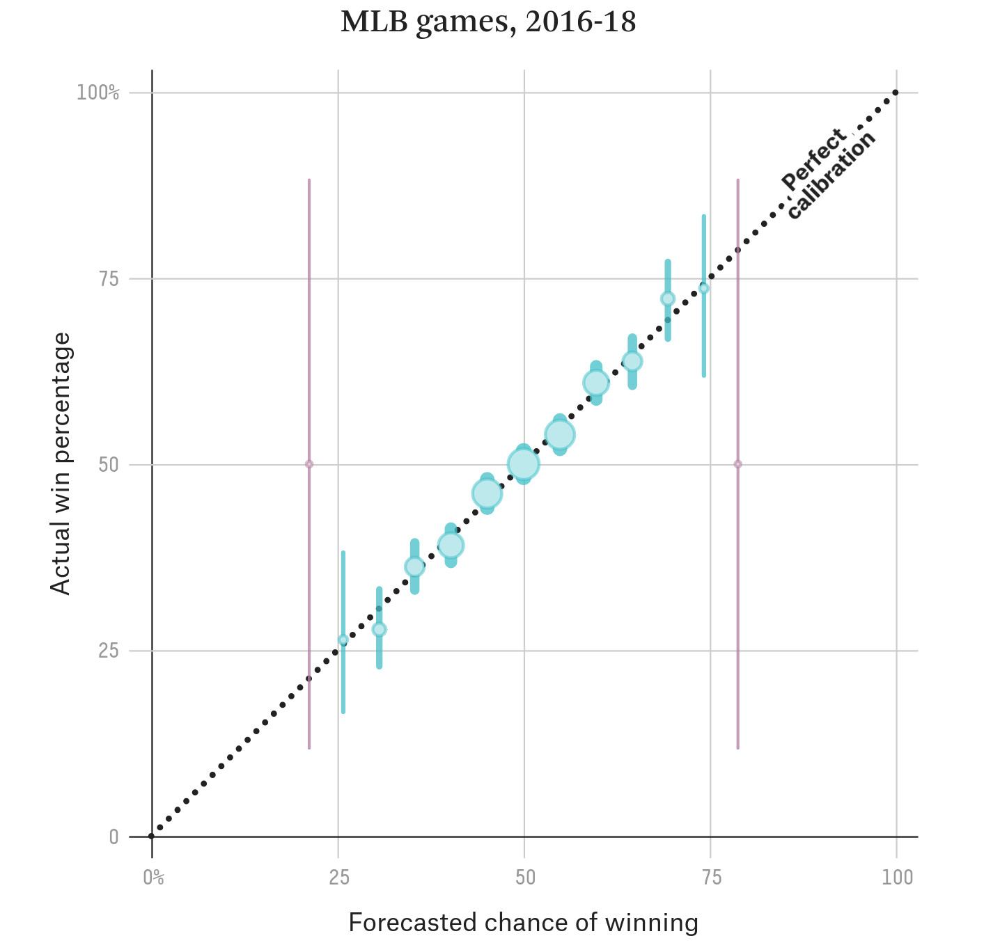

```{r setup, include=FALSE}
knitr::opts_chunk$set(echo = TRUE)
```



https://projects.fivethirtyeight.com/checking-our-work/

## Chart Elements

Scatterplot Data:

+ x - Forecasted win percentage
+ y - Actual win percentage
+ size - The number of games in a bin
+ line - 95% confidence interval lines
+ color
+ point shape

Fixed Diagnal Line:

+ Dotted black line
+ "Perfect Calibration" label

Labels:

+ title, x label and y label

## Data Import

```{r}
x <- read.csv('mlb-data.csv')
head(x)
```

## First Scatterplot

```{r}
library(ggplot2)
ggplot(data = x) + geom_point(mapping = aes(x = Forecast, y = Actual, size = Teams))
```

## Second Scatterplot

```{r}
calplot <- ggplot(data = x) +
  geom_point(aes(Forecast, Actual, size = Teams), color = 'blue', fill = 'lightblue', shape = 21)
print(calplot)
```

## Change Theme

```{r}
calplot <- calplot + theme_minimal()
print(calplot)
```


## Adding the 95% CI

```{r}
calplot <- calplot +
  geom_linerange(aes(Forecast, ymin = Actual - Interval, ymax = Actual + Interval), color = 'blue')
print(calplot)
```

## Comparision 1

```{r, fig.width=16, fig.height=8, message=FALSE}
library(ggpubr)
library(patchwork)
library(png)

screencap <- ggplot() + background_image(readPNG('538-calibration-chart.png'))
(screencap + calplot)
```

Ensure that the points (0,0) and (100,100) are included in the chart:

```{r}
calplot <- calplot + 
  geom_blank(aes(x = 0, y = 0)) +
  geom_blank(aes(x = 100, y = 100))
print(calplot)
```

## Add Labels

```{r}
calplot <- calplot + labs(title = 'MLB games, 2016-18', 
                          x = 'Forecasted chance of winning', 
                          y = 'Actual win percentage')
print(calplot)
```

## Add Perfect Calibration Line

```{r}
calplot <- calplot + geom_abline(aes(intercept = 0, slope = 1), lty = 4)
print(calplot)
```

## Add Perfect Calibration Text

```{r, fig.width=10, fig.height=8}
calplot <- calplot +
  geom_text(aes(x = 92, y = 92, label = 'Perfect\nCalibration', angle = 45))
print(calplot)
```

## Comparision 2

```{r, fig.width=16, fig.height=8, echo=FALSE}
(screencap + calplot)
```
