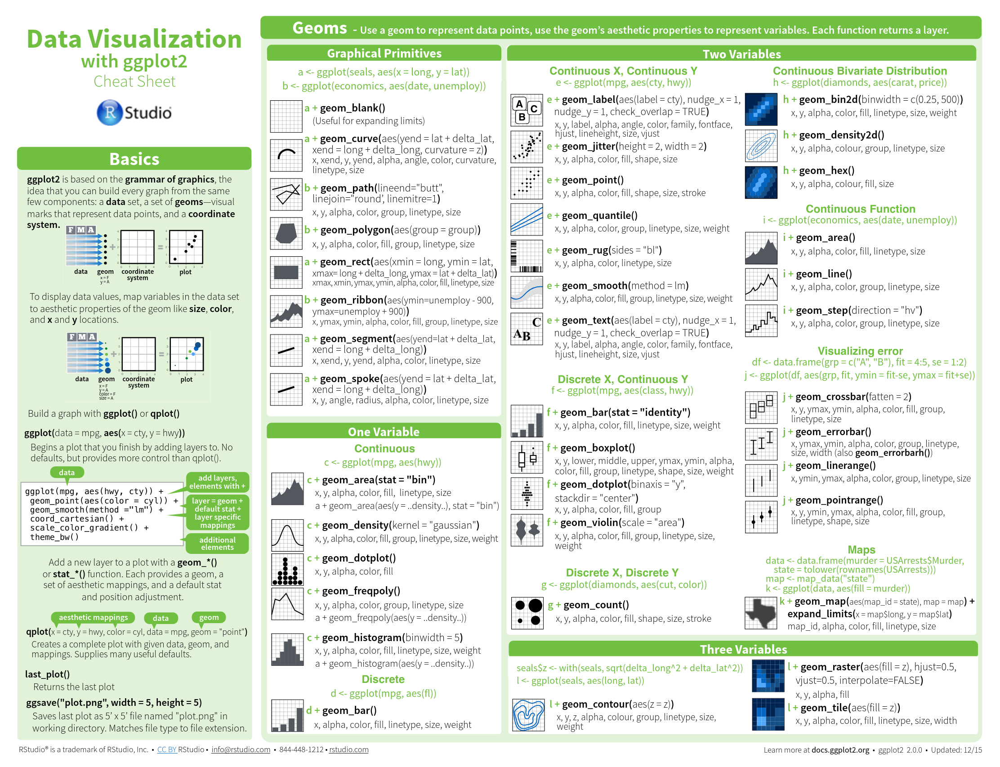
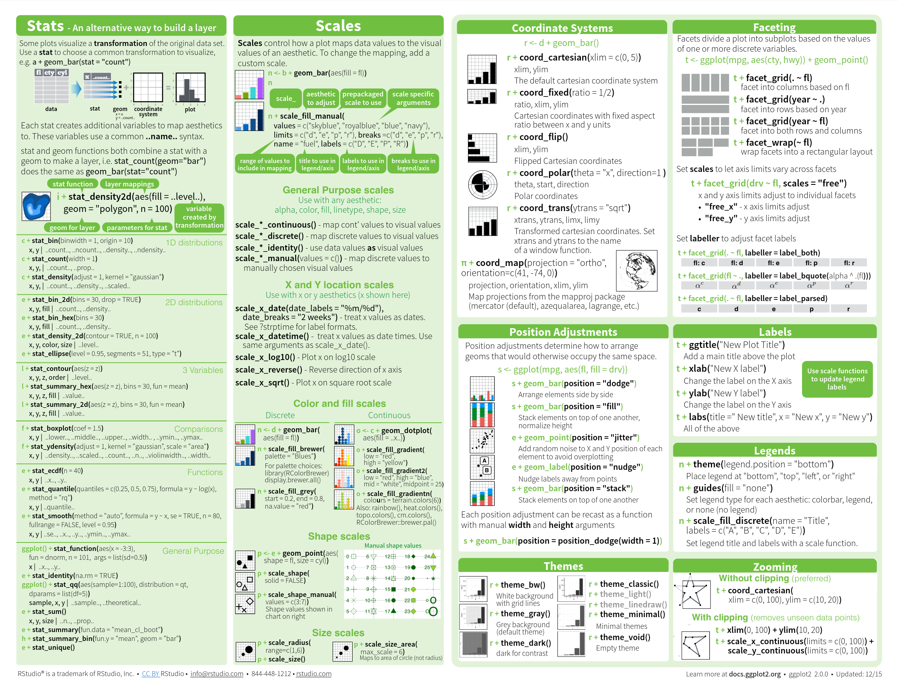
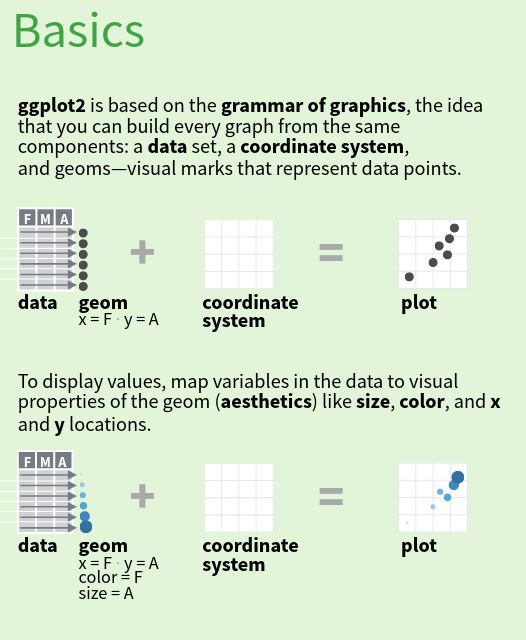
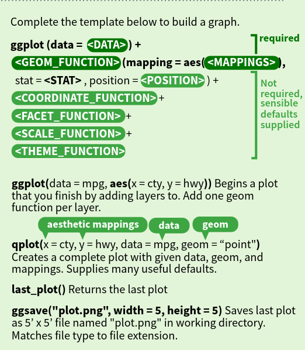
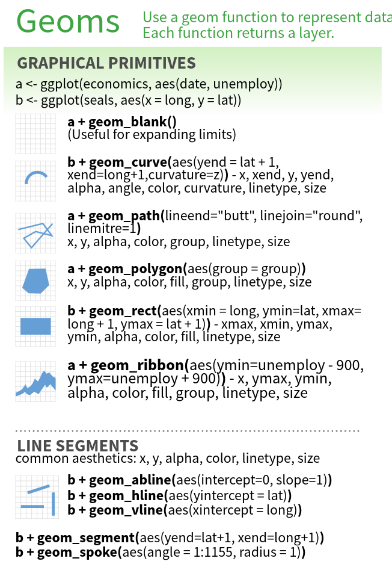
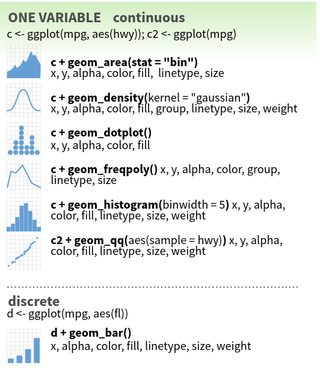
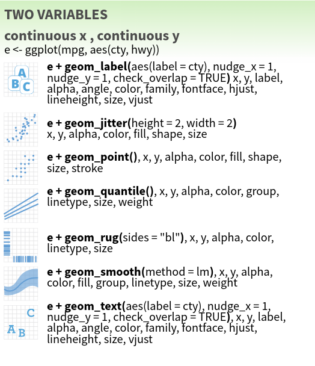
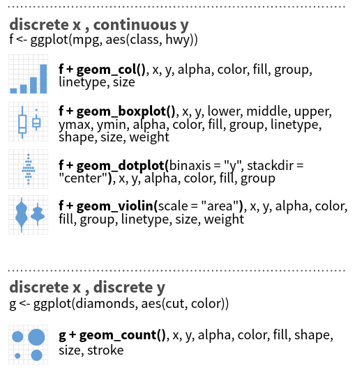

## The Layered Grammar of Graphics

```“The simple graph has brought more information to the data analyst’s mind than any other device.”```

```— John Tukey```

This talk will cover the following:

+ A brief history of ggplot2 and earlier work
+ Some advantages of ggplot2 over base R graphics
+ A quick review of the grammar used in ggplot2
+ Learning the basics of ggplot2 using the ggplot2 cheat sheet to create interesting data visualizations

Part 1 of 3: Focusing on the visual elements of ggplot2.

## A Brief History

Based on [The Grammar of Graphics](https://smile.amazon.com/Grammar-Graphics-Statistics-Computing/dp/0387245448) by Leland Wilkinson (2000).

ggplot releases:

+ [ggplot1](https://github.com/hadley/ggplot1) was released in April, 2006.
  + __Do NOT use this release.__
  + Hadley uses it as a guide for API design in R.
+ [ggplot2](https://github.com/tidyverse/ggplot2) was released in June, 2007.
  + Feature freeze in February 2014.
  + The official extension mechanism was added in December 2015.

## The Layered Grammar of Graphics

If you're interested in the theoretical underpinnings of ggplot2:
<p>
[The Layered Grammar of Graphics](layered-grammar.pdf) by Hadley Wickham (2010).

+ Contrasts the ggplot2 approach with the earlier approach by Wilkenson
+ Introduces the concept of layers
+ Added to the existing R programming language

## Why Should I use ggplot2

+ Charts are more elegant than those found in base R
+ Well supported; Provides a wide variety of charts and themes
+ Well designed API (OOP plus FP plus DSL)
+ Building charts in layers is quite intuitive

```{r, echo=FALSE, fig.width=8, fig.height=3}
library(ggplot2)
# ggplot(mpg, aes(fl, hwy)) + geom_violin() + geom_boxplot(alpha = .2)
ggplot() +
  geom_line(data = economics, aes(x = date, y = uempmed)) +
  geom_rect(data = presidential[-1:-2, ],
            aes(xmin = start, xmax = end, ymin = 3, ymax = 26, fill = party), alpha = .3)
```

## The Benefits of using a Grammar

```A grammar of graphics is a tool that enables us to concisely describe the components of a graphic.```

```— Hadley Wickham```

The most important reason is the grammar:

+ The MIT "language gives us power over problems" approach to problem solving
+ See relationships between graphs, components and data that might not be obvious otherwise
+ A higher level of abstraction than pen and paper approaches
+ Provides a concise way of thinking about the connection between data and graphs

## ggplot2 Cheat Sheet

You may want to open the [ggplot2 cheat sheet](https://github.com/tidyverse/ggplot2):

{width=400px; height=300px}

+ Google "ggplot2 github"; Link in the Readme file
+ The latest update is 12/2018 (bottom right corner)

##

{width=800px; height=600px}

##

{width=800px; height=600px}

## Section: Basics

Main idea: Every graph can be built from the same components.

{width=300px; height=200px}

Components:

+ Data - A data frame or Tibble ("tidy data")
+ Geometric objects implemented as "geom functions"
+ Coordinate System implemented as "coord functions"

## Section: Basics

+ Every graph involves __mapping__ __data__ to __geometric objects__
+ More specifically, columns of __data__ are __mapped__ to the __aesthetic__ elements of __geometric objects__.

{width=300px; height=200px}
<p>
Aesthetics are the "visual properties" of the Geometric objects:

+ x, y, z
+ size, shape, fill

## Basics: ggplot2 Grammar

{width=300px; height=200px}
<p>
+ Additional components: Stats, Facets, Scales, Themes
+ Required vs Optional (far right)
  + Required components are dark green
+ How to start a plot using ggplot()
+ Add layers to a plot using the geom functions

## Grammar Template

```
ggplot(data = <DATA>) + 
  <GEOM_FUNCTION>(
     mapping = aes(<MAPPINGS>),
     stat = <STAT>, 
     position = <POSITION>
  ) +
  <COORDINATE_FUNCTION> +
  <FACET_FUNCTION> +
  <SCALE_FUNCTION> +
  <THEME_FUNCTION>
```

+ Components/Layers are added using '+'
+ Visual layers are added using geom functions
+ Aesthetics can also be set in the call to ggplot()

## Basics: Utility Functions

{width=300px; height=200px}
<p>
+ Functions:
  + qplot - DO NOT USE THIS!
  + last_plot
  + ggsave

## Section: Geoms

Geoms are grouped into subsections based on the number and type of variables:

+ Primitives: lines, line segments and shapes
+ 1 Variable: continuous or discrete
+ 2 Variables:
  + continuous, continuous
  + discrete, continuous
  + discrete, discrete
+ 3 Variables: ...

A more concise way of thinking vs Ad Hoc data visualization

## Geoms: Graphical Primitives

{width=300px; height=200px}
<p>
Graphical primitives = "shapes".  Common uses:

+ Add horizontal and/or vertical lines
+ Add rectangles with background colors

Notice the assignment to the variables which are used later.

## Geoms: Graphical Primitives

Not assigning to the variable would create a plot.

```{r}
ggplot(economics, aes(date, unemploy))
# a + geom_blank()
```

## Geoms: One Variable

{width=300px; height=200px}
<p>
Is the variable being mapped "continuous" or "discrete"?

+ Continuous data types:
  + integer, double, numeric
+ Discrete data types:
  + character, factor (ordered and unordered)

Notice "stat" was changed to "bin" in geom_area.

## Geoms: One Variable (continuous)

```{r}
ggplot(data = diamonds) +
  geom_freqpoly(mapping = aes(x = carat), bins = 50)
```

## Geoms: One Variable (discrete)

```{r}
ggplot(mpg) + geom_bar(aes(manufacturer))
```

## Geoms: Two Continuous Variables

{width=300px; height=200px}
<p>
+ 4 of the 7 geoms are variations on scatter plots:
  + point, jitter, label and text
  + I'm not a fan of the "jitter geom"
+ The three remaining geoms are typically used to add additional layered information to a scatter plot:
  + quantile, rug and smooth

## Geoms: Two Continuous Variables

```{r}
ggplot(mpg) + 
  geom_point(aes(displ, hwy, color = cyl), position = 'jitter')
```

## Geoms: Two Continuous Variables

```{r}
# ggplot(mpg) + 
#   geom_point(aes(displ, hwy, shape = cyl), position = 'jitter')
```

__Error: a continuous variable can not be mapped to shape__

+ All aes parameters, not just x, y and z, map to either continuous or discrete variables
+ Because cyl is discrete, a cyl that doesn't exist was added to the previous slide (cyl = 7)

## Geoms: Two Variables...

{width=300px; height=200px}

+ Two chart types for the discrete, continuous combination:
  + Bar chart called geom_col
  + Boxplot variations: boxplot, violin and dotplot
+ And geom_count for the discrete, discrete combination

## Geoms: Two Variables...

A common issue when learning ggplot2 is selecting the correct type of bar chart:

+ geom_bar is used with 1 variable with discrete data
+ geom_col is used with 2 variables (discrete, continuous)

If you want the heights of the bars to represent values in the data, use geom_col.

## Geoms: Two Variables... and two layers

```{r, fig.height=2}
ggplot(data = mpg, mapping = aes(x = fl, y = hwy)) + 
  geom_violin() + geom_boxplot(alpha = .1)
```

+ The data/aes mapping is in ggplot()
+ A second layer has been added using the '+' special operator
  + Notice that alpha is not inside a call to aes
+ Additional insight: fl = c is missing from the violin plot
+ The median is not obvious for fl = d; Shape of fl = d vs fl = r

## Geoms: Two Variables...

where both x and y are discrete.

```{r}
ggplot(mpg) + geom_count(aes(class, manufacturer))
```

## Geoms: The Remaining Geoms

Two variables:

+ Continuous bivariate distribution:
  + heat maps and 2d density charts
+ Continuous function: 
  + Time-series data
  + Geoms for area, line and step
+ Visualizing error
+ Maps for Geographic map data

Three variables:

+ Three variable contour maps

## Geometric Objects & Aesthetics

Each geom can only display certain aesthetics:

+ A point geom has position, color, shape, and size aesthetics
+ A bar geom has position, height, width, and fill color.

Each geom has two or more aes which determine the graphical output for a layer.

## Aesthetics

aes accepts the following mappings to variables:

+ x, y
+ alpha
+ color (or colour or col or fg) - Outside edge
+ fill - inner area
+ group (will not create a legend)
+ shape (or pch ... shape only accepts up to 6 groups)
+ size (or cex)
+ stroke - controls the width of the shapes border

## Aes Behavior & Types of Data

| Aes Parameter | Categorical           | Continuous                |
|---------------+-----------------------+---------------------------|
| alpha         | Warning - Not advised | Alpha Gradient            |
| color, fill   | Discrete Colors       | Color Gradient            |
| shape         | Discrete Shapes       | Error - Cannot be mapped  |
| size          | Warning - Not advised | Size Gradient             |
| stroke        | Error                 | Adjs lwd of shapes border |

## Aes mapped to variable conditions

```{r}
ggplot(data = mpg) +
  geom_point(mapping = aes(x = displ, y = hwy,
                           color = class == '2seater'))
```

## The End

Part 2 will cover:

+ Coordinate Systems
+ Position Adjustments
+ Themes
+ Faceting
+ Labels
+ Legends
+ Zooming

## Take Home Exercise

```{r, echo=FALSE}
ggplot() + 
  geom_line(data = economics, aes(x = date, y = uempmed)) + 
  geom_rect(data = presidential[-1:-2, ], 
            aes(xmin = start, xmax = end, ymin = 3, ymax = 26, fill = party), alpha = .4)
```

+ Data Sets: economics and presidential
